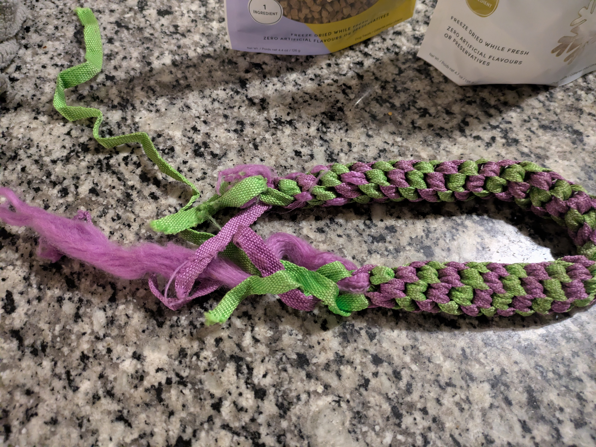

# Sienna's Care Guide

Thank you so much for taking care of Sienna for two weeks while we're away! We really appreciate it.

To make things easier, I've put together this guide with information about her food, schedule, toys, and quirks. Please don't hesitate to reach out if you have any questions at all!

---

## 1. Feeding

We've packed her food & water and bowls. There should be a total of 3 stainless steel bowls.

* **Comfort Blanky**
    * We'll pack a couple of comfort items that have Sienna's scent so you can make a cosy sleep place for her.
    * ,  

* **Bowls:**
    * We use the deeper stainless steel bowl with paw prints for water and one of the shallower ones for her food.
    * When the water bowl is empty Sienna will tap it and sometimes flip it around to tell you that she wants more water. We try to keep it full at all times but it is really cute when she does that. ;)
    * 
    * 

* **Wet Food :**
    * **What:** Cesar Turkey (and other variants) Recipe
    * **How to use:** We usually give her the wet-food in the morning. It is generally a good idea to chunk it into smaller cubes. If it is left as one big chunk she might carry it to a different place and eat it there and nobody wants that. If it warm and for some reason she isn't interested in it in the morning, you can also put it in the fridge and offer it to her later again. She is a bit of an irregular eater. Sometimes she it's it right after her morning potty and sometimes she waits until dinner. We haven't really found a pattern.
    * 

* **Dry Food / Kibble:**
    * **What:** Pedigree Bouchées Tendres (Yellow Bag)
    * **When:** We put out the dry food **AFTER** she ate her wet-food. About 1/2 - 3/4 cup worth of the kibble and just leave it there for her to eat whenever she feels like it. If she is looking for food we top it up with a little more. Really depends on how much excercise / exxcitement she had during the day etc.
    * 

* **Dental Treats:**
    * **What:** Wellness WHIMZEES (Green Box)
    * **How often:** She can have **one** dental treat per day. It's great for her teeth!
    * It's also a high-value tree and I usually use to also enforce commands and tricks we teacher her. 
    * 

* **Special Treats:**
    * **What:** Crumps' Naturals (Mini Trainers and Nice Nibbles)
    * These are high-value treats, perfect for rewarding her for doing tricks or obeying to commands. These are great for training. A few of these a day is plenty.
    *  

---

## 2. Walks & Potty Breaks

* **The Potty Bell!**
    * Sienna knows how to tell you when she needs to go outside! We have a bell that [e.g., hangs on the backdoor doorknob]. If you hear her ringing it with her nose or paw, please let her out for a potty break.
    * Since she will be in a different home you may have to show her her bell. I think she will catch on pretty quick.
    * 

* **Leash & Walks:**
    * Her leash is the pink rope one. The handle is padded for comfort.
    * We usually just tied a poop bag to the leash, so you can pick up after her. We will also give you guys a fresh roll of poop bags.    
    * She is used to about two - three walks a day: a shorter one in the morning and afternoon and a longer one in the morning. Depending on when you wanna go to bed make sure that she pees / poops shortly before that. You can also for instance stop giving her water after 8/9pm, let her pee after that and then she should be good for the night. I think there will be some learning / adjustment to whatever your rhythm is.
    * When we get to a bigger road I usually tell her to "sit". When she is excited and doesn't listen, I follow that up with a gentle tug on the leash and tell her to "sit" again. And then when we cross I will say "come one. let's go."
    * 

---

## 3. Toys & Playtime

Sienna loves to play! Here are some of her favorites:

* **The Puzzle Toy (Green & Yellow Ball):**
    * This is a food-dispensing toy. You can put some of her kibble or a few of the small Crumps' treats inside. I mostly use kibble because it doesn't take her very long to get to it and then we use all the high-reward foods too quickly. She has to nudge and roll it to get the treats out. It’s a fantastic way to keep her mentally stimulated. Although she is very good at it. You have to adjust the size of the openings to the food you put inside to pace the speed of dispensing it.
    * , 

* **Monkey Rope Toy:**
  * She loves to chew on the rope limbs and carry this one around. It's another good toy for independent play or light tugging.
  * 

* **Braided Rope Toy (Purple & Green):**
    * A classic favorite for chewing and a gentle game of tug. Please keep an eye on her with this one—if she starts to pull off and eat the strings, gently take the parts away from her.
    * 

---

## 4. Commands and Tricks

* **Sit**
  * TODO
* **Down**
  * TODO
* **Paw**
  * TODO
* **High Five**
  * TODO 
* **Twirl**
  * TODO

---

## 5. Grooming

If you have time, she would love a little brushing. It helps keep her coat clean and free of tangles. Also helps with the typical dog-smell.

* **Grooming Glove:** This is great for a gentle, all-over brush to remove loose fur.
* **Metal Comb:** Use this for any more stubborn areas or if you find any small tangles, particularly behind her ears or on her legs.
* 

---

## 6. Emergency Information

* **Our Vet:**
  * The Hamlet Veterinary Clinic
    * Address: 2592 Innes Road, Gloucester, ON, K1B 4Z6
    * Phone: 613-837-7387
* **Emergency Vet Clinic:**
  * VCA Canada Ottawa Veterinary Hospital
    * Phone: 613-725-1182

Thank you again for everything! We know Sienna will have a wonderful time with you. Please send us updates and pictures!

Best,

